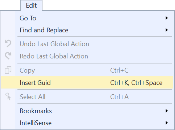

# Insert new Guid command

Makes it super easy to insert a new GUID into any editor and input field. 

Insert a new GUID by invoking the command under the **Edit** top-level menu or hit `CTRL+K,Space`.

If Visual Studio is unable to insert the GUID, it will be copied to the clipboard so you can easily paste it in manually. When a GUID is copied to the clipboard, a notification will be displayed in the status bar.

